> ### EEE3314: Introduction to Artificial Intelligence

# Assignment III:  Neural Networks

### *Assignement Instructions:*
- **Due date**: 11 PM, Dec. 23, 2023
- **File name**: [ID_Name_HW3.ipynb]
- Write a program implementing a particular algorithm to solve a given problem.   
- **Analyze the algorithm, theoretically and empirically. Report and discuss your results.**

### *Collaboration policy:*
- You may discuss the questions with your friends, but each student writes their own codes and answers.  
- **Cheating is strictly prohibited, and will be considered academic dishonesty. This is not how you want to start your career as an engineer.**
We expect that most students can distinguish between helping other students and cheating. Explaining the meaning of a question or discussing a way of approaching a solution is an interaction. But you should write your homework solution strictly by your so that your hands and eyes can help you internalize the subject matter. You should acknowledge everyone whom you have worked with, or who has given you any significant ideas about the homework.
- Signiture: <span style="color:blue">[2021142265] [김혁진]</span>


```python
import datetime
print("This code is written at " + str(datetime.datetime.now()))
```

    This code is written at 2023-12-23 19:08:22.757155


```python
%load_ext autoreload
%autoreload 2
%matplotlib inline
```

## Problem statement

We will implement a simple neural network for classification. Let's first see how a simple logistic regression method works on the $\text{moon}$ dataset. This dataset has been widely used to evaluate performance of a nonlinear classifier or clustering methods. We can synthetically generate the dataset with labels from the $\texttt{sklearn.linear_model}$. See the example shown below. 


```python
from project3 import *
```


```python
import numpy as np
import matplotlib.pyplot as plt
import sklearn.datasets
from sklearn.model_selection import train_test_split

plt.rcParams['figure.figsize'] = (10.0, 8.0)
plt.rcParams['font.size'] = 16
```


```python
# dataset
np.random.seed(0)
X_train, y_train = sklearn.datasets.make_moons(300, noise = 0.25)
```

Let's viaualize the $\texttt{moon}$ dataset with the $\texttt{scatter}$ function from $\texttt{matplotlib.pyplot}$.


```python
plt.scatter(X_train[:,0], X_train[:,1], s = 40, c=y_train, cmap=plt.cm.RdYlGn)
```


    <matplotlib.collections.PathCollection at 0x7fc1c05197c0>


    
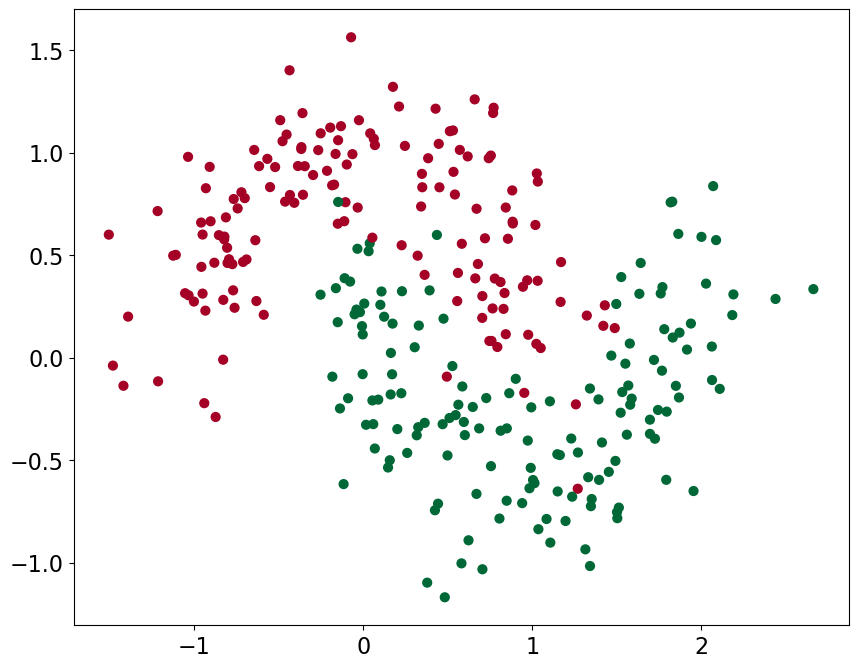
    


It is impossible to classify samples in the dataset using linear classifiers such as a logistic regression method. That is, drawing a straight line (i.e., decision boundaries) to divide training samples into two different regions is not feasible. 

The $\texttt{sklearn.linear_model}$ provides a set of linear models. See the following webpage: http://scikit-learn.org/stable/modules/generated/sklearn.linear_model.LogisticRegressionCV.html. 


```python
import sklearn.linear_model
```

Let's apply logistic regression to the $\texttt{moon}$ dataset and draw decision boundaries. You can use the help function ($\texttt{plot_decision_boundary}$) that takes three values (or functions) as inputs. $\texttt{pred_func}$ is an output of the classifiers, e.g., the output value of the sigmoid function in case of logistic regression. Other two arguments, $\texttt{train_data}$ and $\texttt{color}$, are the training dataset and color for each label in the dataset, respectively. See the example below.


```python
# logistic regression
clf = sklearn.linear_model.LogisticRegressionCV()
clf.fit(X_train, y_train)
```


    LogisticRegressionCV()


```python
# plot boundary
plot_decision_boundary(pred_func=clf.predict, train_data = X_train, color = y_train)
plt.title("Logistic Regression")
```


    Text(0.5, 1.0, 'Logistic Regression')


    
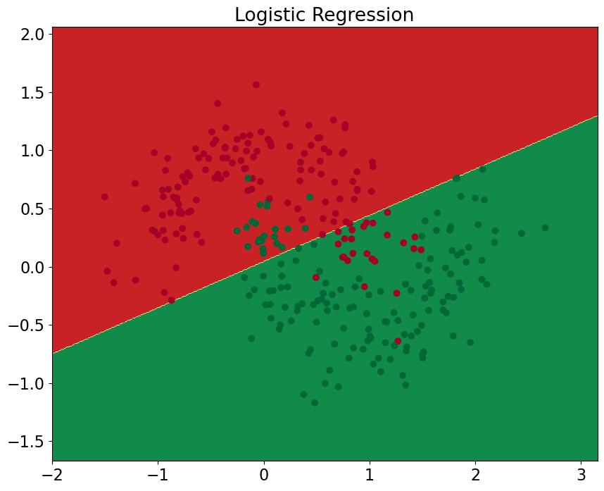
    


```python
print(f"X_train.shape: {X_train.shape}")
print(f"y_train.shape: {y_train.shape}")
```

    X_train.shape: (300, 2)
    y_train.shape: (300,)


As you can see, we should exploit nonlinear classifiers to classify such datasets. Let's implement a nonlinear classifier with a simple neural network, and apply it to classify samples in the $\texttt{moon}$ dataset. The neural network we will implement consists of series of fully connected layers followed by nonlinear activation functions. 

### P1. Implement neural networks (Flat implementation) (50 points)
Implement a multilayer perceptron method (```class NeuralNetwork```) using gradient descent. A detailed description of the nework is shown below. Plot a decision boundary on the $\texttt{moon}$ dataset. Plot training losses and training accuracy over the number of epochs. 

 > $H_1 = X \cdot W_1 + b_1$   
 > $z_1 = ReLU(H_1)$ where $ReLU$($=\max(0,x)$) is a rectified linear unit and $z_1$ is an output of the first hidden layer.  
 > $H_2 = z_1 \cdot W_2 + b_2$   
 > $z_2 = tanh(H_2)$ where $\tanh$ is a tanh function and $z_2$ is an output of the second hidden layer.    
 > $H_3 = z_2 \cdot W_3 + b_3$   
 > $\hat y = \sigma(H_3)$ where $\sigma$ is a sigmoid function unit and $\hat y$ is an output of the network.
 
 
Note that sigmoid function is typically used for binary classification to obtain scores of $[0,1]$. 
 
 > **$W$** and **$b$** are weights and bias, respectively.    
 > **Initialization for weight**: Standard normal (use $\texttt{np.random.randn}$.)  
 > **Initialization for bias (intercept)**: 0     
 > **Input size**: 2  
 > **The first hidden layer size**: 10  
 > **The second hidden layer size**: 10  
 > **Output size**: 1   
 > **Regularization parameter $\lambda$**: 0.001  
 > **Loss function**: Binary cross entropy loss (or equivently log loss). For each training sample, we define a log loss function as follows:
 >
 > $L = -y\log \hat{y} -(1-y)\log(1-\hat{y})$
 >
 > where $y$ is a ground truth that has the value of 0 or 1.   
 > **Total loss** : summation of the losses for the entire training samples and L2 normalized weights for regularization, as follows:
 >
 > $L_{total} = -\sum_{i=1}^N{ (-y^{(i)}\log \hat{y}^{(i)} -(1-y^{(i)})\log(1-\hat{y}^{(i)})) } +  \lambda \|W\|^2 $  
 >
 > where $y^{(i)}$ and $\hat{y}^{(i)}$ are the ground truth and the output of the network of i-th sample respectively.  
 > **Optimization**: Gradient descent  
 > **Learning rate** = 0.001  
 > **Number of epochs** = 50000

### P2. Implement neural networks (Modular implementation) (30 points)

Implement ```class Linear```, ```class ReLU```, ```class Tanh```, ```class Sigmoid``` and ```class NeuralNetwork_module```.

We will implement a multilayer perceptron method with modular functions, similar to the generic deep learning libraries such as `PyTorch` and `TensorFlow`.  To perform classification using ```class NeuralNetwork_module```, we define `forward` and `backward` operations for each layer (e.g., ReLU, a linear layer (i.e., y=Wx), Tanh, or a sigmoid layer), whose inputs and ouputs are matrices. Note that a linear layer (```Linear``` class) also inputs an additinal weight matrix. Note also that we should chche data needed for a backward pass in `forward` operations.


Please see the description for `forward` and `backward` operations in the linear layer (```class Linear```) below.
```python
class Layer(Object):
    @staticmethod
    def forward(x):
      """ Receive inputs x and weights w """
      # Do some computations ...
      z = # ... some intermediate value
      # Do some more computations ...
      out = # the output

      cache = (x, out) # Values we need to compute gradients

      return out, cache

    @staticmethod
    def backward(dout, cache):
      """
      Receive dout (derivative of loss with respect to outputs) and cache,
      and compute derivative with respect to inputs.
      """
      # Unpack cache values
      x, out = cache
    
      # Use values in cache to compute derivatives
      dx = # Derivative of loss with respect to x
     
      return dx
```


### P1


```python
np.random.seed(0)

nn_input_dim = 2
nn_output_dim = 1
nn_hdim1 = 10
nn_hdim2 = 10
lr = 0.001 
L2_norm = 0.001
epoch = 50000

model = NeuralNetwork(nn_input_dim, nn_hdim1, nn_hdim2, nn_output_dim, init="random")
stats = model.train(X_train, y_train, learning_rate=lr, L2_norm=L2_norm, epoch=epoch, print_loss=True)
```

    Loss (epoch 1000): 28.893687548275683
    Loss (epoch 2000): 25.905837983011956
    Loss (epoch 3000): 22.94262284771446
    Loss (epoch 4000): 21.03625928501384
    Loss (epoch 5000): 19.58921694709096
    Loss (epoch 6000): 18.217202500683292
    Loss (epoch 7000): 17.39988403128538
    Loss (epoch 8000): 16.992910927727088
    Loss (epoch 9000): 16.741359789139764
    Loss (epoch 10000): 15.229006526420132
    Loss (epoch 11000): 13.848212213692088
    Loss (epoch 12000): 12.941499428871179
    Loss (epoch 13000): 12.633740154233708
    Loss (epoch 14000): 11.99162442373255
    Loss (epoch 15000): 11.541305722402967
    Loss (epoch 16000): 10.985029058986024
    Loss (epoch 17000): 10.798319625139413
    Loss (epoch 18000): 10.066090428209312
    Loss (epoch 19000): 9.78425033825605
    Loss (epoch 20000): 9.491930339062648
    Loss (epoch 21000): 9.168841969565602
    Loss (epoch 22000): 9.52788848711596
    Loss (epoch 23000): 8.56198828678907
    Loss (epoch 24000): 8.355951893982889
    Loss (epoch 25000): 7.990302783884918
    Loss (epoch 26000): 7.927027172924099
    Loss (epoch 27000): 7.086227087515397
    Loss (epoch 28000): 6.762238921419345
    Loss (epoch 29000): 6.537532583600485
    Loss (epoch 30000): 6.3416943755817075
    Loss (epoch 31000): 6.190629094743575
    Loss (epoch 32000): 6.057739194729082
    Loss (epoch 33000): 5.947696652570824
    Loss (epoch 34000): 5.8593508657571665
    Loss (epoch 35000): 5.780611862363584
    Loss (epoch 36000): 5.71733993118853
    Loss (epoch 37000): 5.660353648106543
    Loss (epoch 38000): 5.607806718983977
    Loss (epoch 39000): 5.5616869938346944
    Loss (epoch 40000): 5.519552475964934
    Loss (epoch 41000): 5.481145794622907
    Loss (epoch 42000): 5.446047277472413
    Loss (epoch 43000): 5.412849767095138
    Loss (epoch 44000): 5.3832667797770055
    Loss (epoch 45000): 5.356098087878832
    Loss (epoch 46000): 5.331182774339458
    Loss (epoch 47000): 5.307601428601312
    Loss (epoch 48000): 5.285891188207476
    Loss (epoch 49000): 5.266404199084599
    Loss (epoch 50000): 5.247335950763554


```python
# Plot the decision boundary
plot_decision_boundary(lambda x: model.predict(x), X_train, y_train)
plt.title(f"Decision Boundary: Hidden layer dimension {nn_hdim1, nn_hdim2}")
```


    Text(0.5, 1.0, 'Decision Boundary: Hidden layer dimension (10, 10)')


    
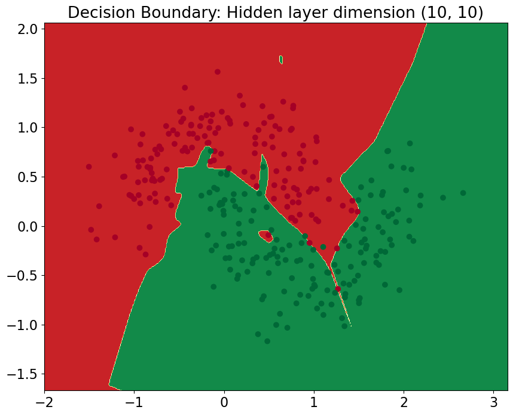
    


```python
plt.subplot(1, 2, 1)
plt.plot(np.arange(len(stats['loss_history'])) * 1000, stats['loss_history'])
plt.xlabel('Epoch')
plt.ylabel('Loss')
plt.title('Training loss over epoch')
plt.subplot(1, 2, 2)
plt.plot(np.arange(len(stats['train_acc_history'])) * 1000, stats['train_acc_history'])
plt.xlabel('Epoch')
plt.ylabel('Clasification accuracy')
plt.title('Training accuracy over epoch')
plt.gcf().set_size_inches(20, 8)
```


    
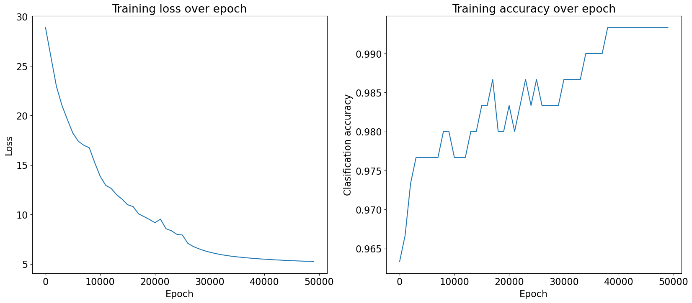
    


### P2


```python
np.random.seed(0)

nn_input_dim = 2
nn_output_dim = 1
nn_hdim1 = 10
nn_hdim2 = 10
lr = 0.001 
L2_norm = 0.001
epoch = 50000

model = NeuralNetwork_module(nn_input_dim, nn_hdim1, nn_hdim2, nn_output_dim, init="random")
stats = model.train(X_train, y_train, learning_rate=lr, L2_norm=L2_norm, epoch=epoch, print_loss=True)
```

    Loss (epoch 1000): 28.712397465764546
    Loss (epoch 2000): 25.711442215065325
    Loss (epoch 3000): 22.675763701937058
    Loss (epoch 4000): 20.73462715512916
    Loss (epoch 5000): 19.35280548873796
    Loss (epoch 6000): 17.90476015461894
    Loss (epoch 7000): 17.136716758658167
    Loss (epoch 8000): 16.334618601414636
    Loss (epoch 9000): 16.241507742310535
    Loss (epoch 10000): 14.496126147936478
    Loss (epoch 11000): 13.150501627683271
    Loss (epoch 12000): 12.606049171010696
    Loss (epoch 13000): 11.795326023949954
    Loss (epoch 14000): 11.345943612929476
    Loss (epoch 15000): 10.757428958940503
    Loss (epoch 16000): 10.446083955929538
    Loss (epoch 17000): 10.009861369937294
    Loss (epoch 18000): 9.578866075842845
    Loss (epoch 19000): 8.980783996767958
    Loss (epoch 20000): 8.758244795268258
    Loss (epoch 21000): 8.532926700457793
    Loss (epoch 22000): 8.391112686729642
    Loss (epoch 23000): 8.38265550622613
    Loss (epoch 24000): 7.413178695435523
    Loss (epoch 25000): 6.972706437652293
    Loss (epoch 26000): 6.754693930383274
    Loss (epoch 27000): 6.415896769828977
    Loss (epoch 28000): 5.915717826727079
    Loss (epoch 29000): 5.663738234894252
    Loss (epoch 30000): 5.4507017779684475
    Loss (epoch 31000): 5.276479849159381
    Loss (epoch 32000): 5.1336426123934435
    Loss (epoch 33000): 5.007800620446996
    Loss (epoch 34000): 4.907164714394376
    Loss (epoch 35000): 4.824727863697416
    Loss (epoch 36000): 4.749769833292456
    Loss (epoch 37000): 4.680912661150829
    Loss (epoch 38000): 4.6188607015585195
    Loss (epoch 39000): 4.562143276209244
    Loss (epoch 40000): 4.51096510250223
    Loss (epoch 41000): 4.462891394110272
    Loss (epoch 42000): 4.418928102688995
    Loss (epoch 43000): 4.378476218656827
    Loss (epoch 44000): 4.340927545139454
    Loss (epoch 45000): 4.306383985161497
    Loss (epoch 46000): 4.273524836473505
    Loss (epoch 47000): 4.243277421818829
    Loss (epoch 48000): 4.214635830142446
    Loss (epoch 49000): 4.188112333324048
    Loss (epoch 50000): 4.163073021976167


```python
plt.subplot(1, 2, 1)
plt.plot(np.arange(len(stats['loss_history'])) * 1000, stats['loss_history'])
plt.xlabel('Epoch')
plt.ylabel('Loss')
plt.title('Training loss over epoch')
plt.subplot(1, 2, 2)
plt.plot(np.arange(len(stats['train_acc_history'])) * 1000, stats['train_acc_history'])
plt.xlabel('Epoch')
plt.ylabel('Clasification accuracy')
plt.title('Training accuracy over epoch')
plt.gcf().set_size_inches(20, 8)
```


    
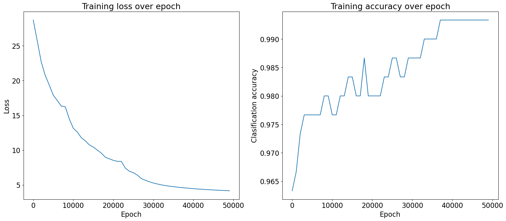
    


```python
# Plot the decision boundary
plot_decision_boundary(lambda x: model.predict(x), X_train, y_train)
plt.title(f"Decision Boundary: Hidden layer dimension {nn_hdim1, nn_hdim2}")
```


    Text(0.5, 1.0, 'Decision Boundary: Hidden layer dimension (10, 10)')


    
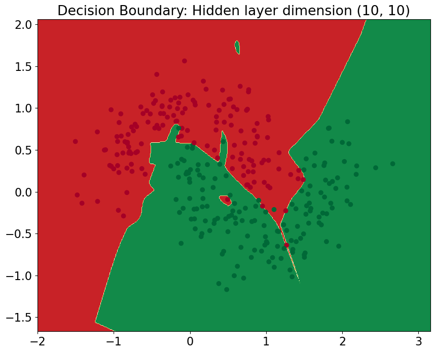
    


### Play with your networks
#### Capacity
Change the numbers of nodes in hidden layers as follows, and plot decision boundaries: (1,1), (2,2), (3,3), (4,4), (5,5), (20,20), (50,50) where the first and second elements are the numbers of nodes in the first and second hidden layers, respectively.


```python
np.random.seed(0)

nn_input_dim = 2
nn_output_dim = 1
lr = 0.001 
epoch = 50000

hidden_layer_dimensions = [1, 2, 3, 4, 5, 20, 50]
for i, nn_hdim in enumerate(hidden_layer_dimensions):
    plt.subplot(5, 2, i+1)
    plt.title(f"Decision Boundary: Hidden layer dimension {nn_hdim, nn_hdim}")
    model = NeuralNetwork(nn_input_dim, nn_hdim, nn_hdim, nn_output_dim, init="random")      
    stats = model.train(X_train, y_train, learning_rate=lr, epoch=epoch,  L2_norm=0.0, print_loss=False)
    plot_decision_boundary(lambda x: model.predict(x), X_train, y_train)
    print(f"Learning NN: Hidden layer dimension {nn_hdim, nn_hdim} ... done")

plt.gcf().set_size_inches(20, 40)
plt.tight_layout()
plt.show()
```

    Learning NN: Hidden layer dimension (1, 1) ... done
    Learning NN: Hidden layer dimension (2, 2) ... done
    Learning NN: Hidden layer dimension (3, 3) ... done
    Learning NN: Hidden layer dimension (4, 4) ... done
    Learning NN: Hidden layer dimension (5, 5) ... done
    Learning NN: Hidden layer dimension (20, 20) ... done
    Learning NN: Hidden layer dimension (50, 50) ... done


    
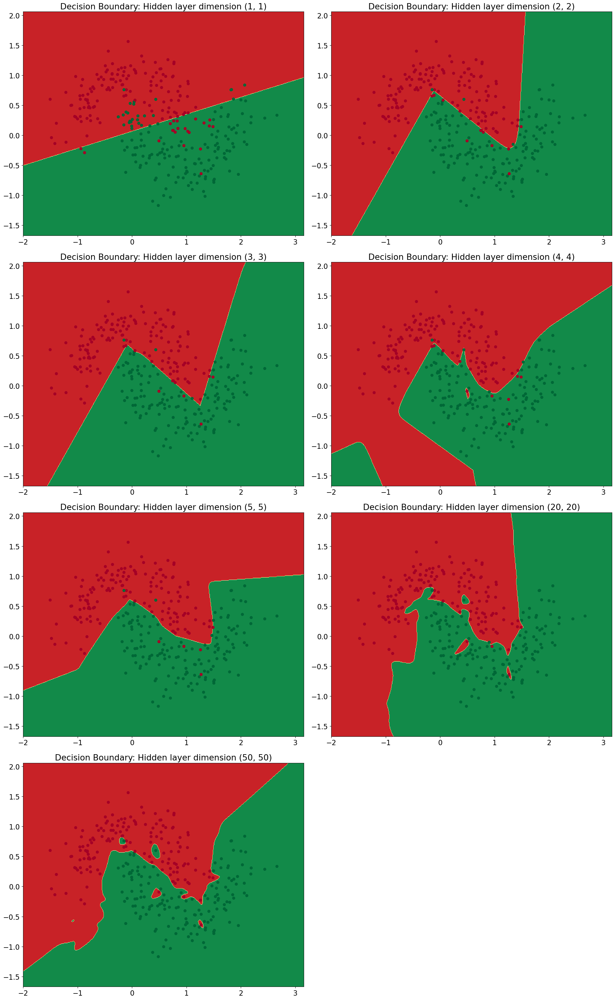
    


#### Regularization
Adjust the regularization parameter $\lambda$ as follows, and plot decision boundaries: \[0, 1e-2, 1e-1, 1\].


```python
np.random.seed(0)

nn_input_dim = 2
nn_hdim = 20
nn_output_dim = 1
lr = 0.001 
epoch = 50000


L2_norm_list = [0, 1e-2, 1e-1, 1]
for i, L2_norm in enumerate(L2_norm_list):
    plt.subplot(2, 2, i+1)
    plt.title(f"Decision Boundary: Regularization: {L2_norm}")
    model = NeuralNetwork(nn_input_dim, nn_hdim, nn_hdim, nn_output_dim, init="random")      
    stats = model.train(X_train, y_train, learning_rate=lr, L2_norm=L2_norm, epoch=epoch, print_loss=False)
    plot_decision_boundary(lambda x: model.predict(x), X_train, y_train)
    print(f"Learning NN: Regularization {L2_norm} ... done")
    
plt.gcf().set_size_inches(20, 20)
plt.tight_layout()
plt.show()
```

    Learning NN: Regularization 0 ... done
    Learning NN: Regularization 0.01 ... done
    Learning NN: Regularization 0.1 ... done
    Learning NN: Regularization 1 ... done


    
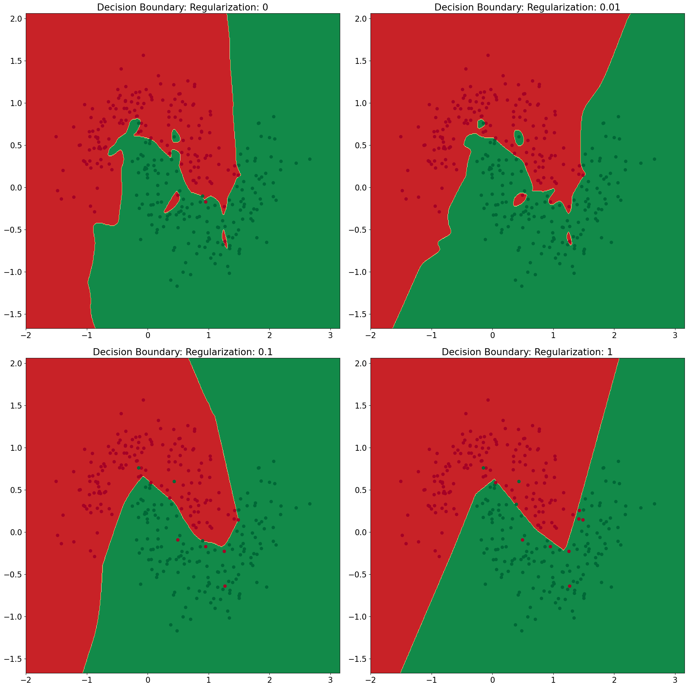
    


### P3. Analysis and discussion (20 points)

Your answer must include.....

- Explanation of your implementation for a multilayer perceptron in both approaches (flat and modular codes)
- Random initialization vs Constant initialization
- Relationship between the number of hidden layers and decision boundary.
- The effect of regularization with respect to the performance.
- The effect of learning rate with respect to the performance.
- Analysis of the above results 

For analysis and discussion, you can exploit all functions you've written or make your own functions (or scripts).

---

### Explanation of your implementation for multilayer perceptron in both approaches


#### Flat code


Backward propation의 경우, gradient = upstream gradient * local gradient 으로 계산을 진행하였다. 
  

- Epoch에 따른 Training Loss  
총 50,000개의 epoch에 걸쳐 학습된 neural network의 loss를 살펴보면, 손실 값은 1000epoch 마다 출력되며, 지속적으로 감소하는 것을 확인할 수 있다.  
이는 시간이 지남에 따라 모델이 학습하고 성능이 향상되고 있음을 나타낸다.  
초기 손실 값은 약 28.9로 높은 값을 갖지만 빠르게 감소하야 최적화가 효과적으로 진행되고 있는 것을 확인할 수 있고, 훈련이 끝날 때 loss는 약 5.24로 크게 감소하여 네트워크의 성능이 향상 됨을 정량적으로 판단할 수 있다.


- Decision Boundary Plot  
Neural Network의 decision boundary를 2D에 나타낸 그래프를 보면, 두 class의 data point를 decision boundary로 구분되어 class에 따라 색상이 다르게 지정되어 있다. Decision boundary는 non-linear하게 형성되어 있는데 이는 neural network가 data의 복잡한 패턴을 학습했음을 의미한다.  
빨간색과 녹색 포인트가 섞여 있는 분류가 모호한 영역이 있음을 확인할 수 있는데 이는 학습된 모델에서 class를 완벽하게 분리할 수 없는 feature space에서 일부 영역이 겹치기 때문이다. 


- Training Performance Graph
    - Epoch에 따른 training loss graph  
    Epoch의 수가 증가할 수록 전반적으로 손실이 감소하는 양상을 보인다. 초기 epoch에서 가파른 감소를 보이다가 점차 평탄해지는 것을 확인할 수 있는데 이는 모델이 초기의 높은 오류 상태에서 학습을 시작한 후 빠르게 개선되어 최적의 상태에 가까워지면서 점진적으로 개선된다. 모델이 학습을 통해 data를 분류하는 능력이 점차 향상 됨을 의미한다. Epoch 횟수가 증가할 때 training loss가 살짝 커지는 부분이 있는데 이는 노이즈로 인한 현상이다. 
    
    - Epoch에 따른 accuracy graph  
    Training loss graph와 다르게 accuracy graph는 epoch 수가 증가함에 따라 증가하는 양상을 보인다. 초기에 낮은 정확도에서 시작하여 시간이 지남에 따라 모델의 성능이 개선되어 99.5% 이상의 정확도에 도달하게 되며, 이는 모델이 training data를 잘 학습하고 있음을 의미한다. Accuracy graph에는 약간의 변동이 있는데, 이는 training process에 있는 noise 또는 model이 다른 local minimum을 탐색했기 때문이라 생각해볼 수 있다. 


#### Modular code

- Epoch에 따른 Training Loss  
총 50,000개의 epoch에 걸쳐 학습된 neural network의 loss를 살펴보면, 손실 값은 1000epoch 마다 출력되며 지속적으로 감소하는 것을 확인할 수 있다.  손실이 점진적으로 감소한다는 것은 모델이 시간이 지남에 따라 발산 또는 불규칙한 손실 동작의 징후 없이 예측을 개선하고 있음을 나타낸다.  


- Decision Boundary Plot  
Neural Network의 decision boundary를 2D에 나타낸 그래프를 보면, 두 class의 data point를 decision boundary로 구분되어 class에 따라 색상이 다르게 지정(빨간색, 녹색)되어 있다. Data point를 구분하는 non-linear decision boundary가 그려지는 것을 확인할 수 있는데 이는 non-linear data의 복잡한 패턴을 포착하는 모델의 능력을 나타낸다. Flat code와 동일하게 녹색 영역 내에 빨간색 점이 몇개 존재하고 그 반대의 경우도 확인이 가능한데 이는 일부 데이터에 대해 잘못된 분류가 된 것을 나타낸다. 경계가 대부분 잘 정의되어 있어 data에 대해 class가 효과적으로 구분되어 있다. 


- Training Performance Graph  

    - Epoch에 따른 training loss graph  
    손실 그래프는 처음에 가파른 감소 추세를 보이다가 학습이 진행됨에 따라 감소 추세가 완화되는 것을 확인할 수 있는데, 이는 모델이 수렴하기 시작할 때 나타나는 현상이다. 모델이 점차 training data에 대해 분류 능력이 향상되는 것이고, 중간 중간에 training loss가 약간 증가하는 부분이 있는데 이는 노이즈로 인해 발생한 현상이다.
       
    - Epoch에 따른 accuracy graph
    Accuracy graph는 약간의 변동이 존재하지만 전반적으로 성능이 개선되는 상승 추세를 보인다. 이는 training data에 대해 모데의 예측이 점차 더 정확해지는 것을 의미한다. 낮은 정확도에서 시작하여 훈련이 끝나는 시점에 약 99.5%의 정확도를 갖는다.

### Random initialization vs Constant initialization

Flat code와 Modular code에서 Constant initalization을 진행하면 아래와 같다.

#### Flat code


```python
# Flat code
np.random.seed(0)

nn_input_dim = 2
nn_output_dim = 1
nn_hdim1 = 10
nn_hdim2 = 10
lr = 0.001 
L2_norm = 0.001
epoch = 50000

model = NeuralNetwork(nn_input_dim, nn_hdim1, nn_hdim2, nn_output_dim, init="constant")
stats = model.train(X_train, y_train, learning_rate=lr, L2_norm=L2_norm, epoch=epoch, print_loss=True)
```

    Loss (epoch 1000): 136.39971667527726
    Loss (epoch 2000): 119.55530523230206
    Loss (epoch 3000): 119.54207934827593
    Loss (epoch 4000): 119.5254927879766
    Loss (epoch 5000): 119.50334366921633
    Loss (epoch 6000): 119.46756399233294
    Loss (epoch 7000): 119.39783095913435
    Loss (epoch 8000): 119.19570591328284
    Loss (epoch 9000): 106.4067008048299
    Loss (epoch 10000): 103.9840957983367
    Loss (epoch 11000): 101.59111088685346
    Loss (epoch 12000): 100.01351567296348
    Loss (epoch 13000): 98.9480251833009
    Loss (epoch 14000): 98.25122992411619
    Loss (epoch 15000): 97.78671924391082
    Loss (epoch 16000): 97.46427036550158
    Loss (epoch 17000): 97.23892648440732
    Loss (epoch 18000): 97.08108895855398
    Loss (epoch 19000): 96.96788431194494
    Loss (epoch 20000): 96.88355852715156
    Loss (epoch 21000): 96.81914581753293
    Loss (epoch 22000): 96.76874081229761
    Loss (epoch 23000): 96.72840558598729
    Loss (epoch 24000): 96.69546898630624
    Loss (epoch 25000): 96.6680846630109
    Loss (epoch 26000): 96.64495138563112
    Loss (epoch 27000): 96.62513431300863
    Loss (epoch 28000): 96.60794921206937
    Loss (epoch 29000): 96.5928862818409
    Loss (epoch 30000): 96.57955921334216
    Loss (epoch 31000): 96.5676705659504
    Loss (epoch 32000): 96.55698785709897
    Loss (epoch 33000): 96.54732679620125
    Loss (epoch 34000): 96.53853935559458
    Loss (epoch 35000): 96.53050516463476
    Loss (epoch 36000): 96.52312521893722
    Loss (epoch 37000): 96.51631722401551
    Loss (epoch 38000): 96.51001210730051
    Loss (epoch 39000): 96.50415137540314
    Loss (epoch 40000): 96.49868508980352
    Loss (epoch 41000): 96.49357029992298
    Loss (epoch 42000): 96.4887698179765
    Loss (epoch 43000): 96.48425125175707
    Loss (epoch 44000): 96.47998623392864
    Loss (epoch 45000): 96.4759498024049
    Loss (epoch 46000): 96.47211989791087
    Loss (epoch 47000): 96.46847695319724
    Loss (epoch 48000): 96.46500355452271
    Loss (epoch 49000): 96.46168416055507
    Loss (epoch 50000): 96.45850486723145


```python
# Plot the decision boundary
plot_decision_boundary(lambda x: model.predict(x), X_train, y_train)
plt.title(f"Decision Boundary: Hidden layer dimension {nn_hdim1, nn_hdim2}")
```


    Text(0.5, 1.0, 'Decision Boundary: Hidden layer dimension (10, 10)')


    
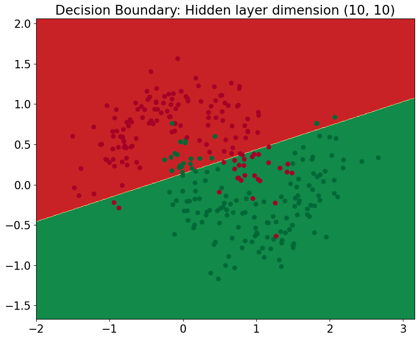
    


```python
plt.subplot(1, 2, 1)
plt.plot(np.arange(len(stats['loss_history'])) * 1000, stats['loss_history'])
plt.xlabel('Epoch')
plt.ylabel('Loss')
plt.title('Training loss over epoch')
plt.subplot(1, 2, 2)
plt.plot(np.arange(len(stats['train_acc_history'])) * 1000, stats['train_acc_history'])
plt.xlabel('Epoch')
plt.ylabel('Clasification accuracy')
plt.title('Training accuracy over epoch')
plt.gcf().set_size_inches(20, 8)
```


    
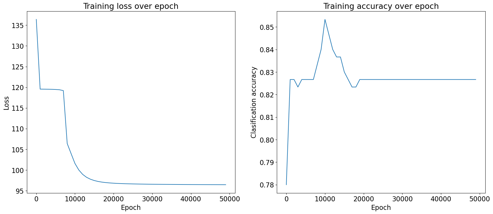
    


#### Modular code


```python
np.random.seed(0)

nn_input_dim = 2
nn_output_dim = 1
nn_hdim1 = 10
nn_hdim2 = 10
lr = 0.001 
L2_norm = 0.001
epoch = 50000

model = NeuralNetwork_module(nn_input_dim, nn_hdim1, nn_hdim2, nn_output_dim, init="constant")
stats = model.train(X_train, y_train, learning_rate=lr, L2_norm=L2_norm, epoch=epoch, print_loss=True)
```

    Loss (epoch 1000): 136.31882163486205
    Loss (epoch 2000): 119.44205816281317
    Loss (epoch 3000): 119.43198591089265
    Loss (epoch 4000): 119.41860416812618
    Loss (epoch 5000): 119.40183840761141
    Loss (epoch 6000): 119.37547045051323
    Loss (epoch 7000): 119.32701095863925
    Loss (epoch 8000): 119.2132844918479
    Loss (epoch 9000): 115.22762797968105
    Loss (epoch 10000): 105.81448788340208
    Loss (epoch 11000): 103.73513379191178
    Loss (epoch 12000): 101.41054049508374
    Loss (epoch 13000): 99.83906185789024
    Loss (epoch 14000): 98.78922288176221
    Loss (epoch 15000): 98.1241409387912
    Loss (epoch 16000): 97.68723970154585
    Loss (epoch 17000): 97.38731535072097
    Loss (epoch 18000): 97.18201354107151
    Loss (epoch 19000): 97.0374232437161
    Loss (epoch 20000): 96.93309314316697
    Loss (epoch 21000): 96.85494632097604
    Loss (epoch 22000): 96.7948570102997
    Loss (epoch 23000): 96.74751210711092
    Loss (epoch 24000): 96.70937350139668
    Loss (epoch 25000): 96.67803717724027
    Loss (epoch 26000): 96.6518355288328
    Loss (epoch 27000): 96.62958786510009
    Loss (epoch 28000): 96.61044154842524
    Loss (epoch 29000): 96.59376913208797
    Loss (epoch 30000): 96.5791005799405
    Loss (epoch 31000): 96.56607781482
    Loss (epoch 32000): 96.55442371649413
    Loss (epoch 33000): 96.54392062752176
    Loss (epoch 34000): 96.53439521818933
    Loss (epoch 35000): 96.52570767166438
    Loss (epoch 36000): 96.51774384827593
    Loss (epoch 37000): 96.51040953330488
    Loss (epoch 38000): 96.5036261614326
    Loss (epoch 39000): 96.49732760097365
    Loss (epoch 40000): 96.49145770778
    Loss (epoch 41000): 96.48596844444253
    Loss (epoch 42000): 96.4808184191406
    Loss (epoch 43000): 96.47597173920337
    Loss (epoch 44000): 96.47139710299443
    Loss (epoch 45000): 96.46706707395657
    Loss (epoch 46000): 96.46295749513882
    Loss (epoch 47000): 96.45904701298886
    Loss (epoch 48000): 96.45531668683151
    Loss (epoch 49000): 96.45174966606962
    Loss (epoch 50000): 96.44833092131077


```python
# Plot the decision boundary
plot_decision_boundary(lambda x: model.predict(x), X_train, y_train)
plt.title(f"Decision Boundary: Hidden layer dimension {nn_hdim1, nn_hdim2}")
```


    Text(0.5, 1.0, 'Decision Boundary: Hidden layer dimension (10, 10)')


    
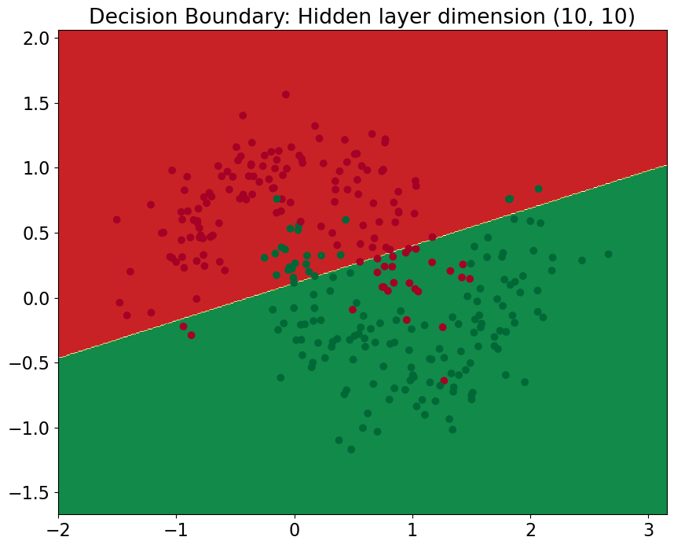
    


```python
plt.subplot(1, 2, 1)
plt.plot(np.arange(len(stats['loss_history'])) * 1000, stats['loss_history'])
plt.xlabel('Epoch')
plt.ylabel('Loss')
plt.title('Training loss over epoch')
plt.subplot(1, 2, 2)
plt.plot(np.arange(len(stats['train_acc_history'])) * 1000, stats['train_acc_history'])
plt.xlabel('Epoch')
plt.ylabel('Clasification accuracy')
plt.title('Training accuracy over epoch')
plt.gcf().set_size_inches(20, 8)
```


    
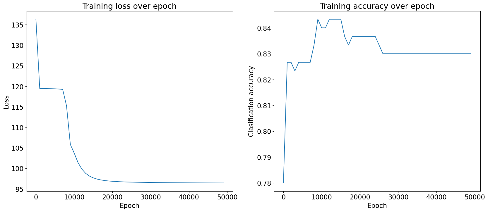
    


#### Flat code

- Epoch에 따른 Training Loss  
총 50,000개의 epoch에 걸쳐 학습된 network의 loss를 살펴보면, train 시작 시 약 136.9로 상당히 높은 값을 출력한다. Epoch수가 증가함에 따라 손실은 감소하지만 약 96.5로 안정화 되는 것을 확인할 수 있다. Loss의 감소 속도는 느리고 final loss가 높다는 것을 보면 model이 효과적으로 학습하지 못하는 것을 알 수 있다. 이는 initialization이 제대로 이루어지지 않아 발생한 현상으로 보이는데, 가중치가 일정할 경우 activation과 gradient의 다양성이 부족해져서 symmetry가 깨지게 되고 데이터를 학습하기 더 어려워지기 때문이다. 


- Decision Boundary Plot  
Decision Boundary가 linear하다는 것은 data의 복잡한 패턴을 제대로 학습하지 못했기 떄문이라 판단할 수 있다. 이는 일정한 initalization으로 인해 neuron이 동일한 feature를 학습하지 못하고 model이 capture 하려는 공간을 다양화 하지 못하기 때문이라 예상할 수 있다. 두 개의 영역에 잘못 classify 된 data가 많이 존재하고 이는 final loss의 값이 큰 것과 비교했을 때 동일한 양상을 띈다는 것을 확인할 수 있고 model의 performance가 좋지 못하다는 것을 나타낸다. 


- Training Performance Graph

    - Epoch에 따른 training loss graph
    초기에 급격한 감소 추세를 보인 후 saturation 되는 상태를 보이는데, 이는 모델의 성능이 더 이상 개선 되지 않음을 의미한다. 중간에 loss가 119 부근에서 잠시 정체되었다가 epoch의 횟수가 더 증가하게 되면 정체 상태를 탈출하게 되는데 이는 local minimum에서 벗어났기 때문이라 판단할 수 있다. 
    
    - Epoch에 따른 accuracy graph  
    이 그래프의 경우 변동 폭이 매우 크고 전체 정확도가 85% 이하로 나타나며 불규칙한 양상을 보인다. 특히 약 11,000 epoch 이후에 정확도는 다시 감소하게 되는데 이는 시간이 지남에 따라 모델이 지속적으로 개선하지 못하는 것을 의미한다. 

#### Modular code

Modular code는 Flat code와 거의 동일한 양상을 보이는데 한 가지 다른 부분을 뽑아 보자면 Training accuracy graph에서 11,000 epoch이 아닌 약 15,000 epoch에서 정확도가 감소한다는 것이다. Modular 코드가 좀 더 변화에 강인한 모습을 보인다고 판단할 수 있다. 그렇지만 최종적인 accuracy는 거의 동일한 값으로 나타나는 것을 확인할 수 있다.

### Relationship between the number of hidden layers and decision boundary.


```python
np.random.seed(0)

nn_input_dim = 2
nn_output_dim = 1
lr = 0.001 
epoch = 50000

hidden_layer_dimensions = [1, 2, 3, 4, 5, 20, 50]
for i, nn_hdim in enumerate(hidden_layer_dimensions):
    plt.subplot(5, 2, i+1)
    plt.title(f"Decision Boundary: Hidden layer dimension {nn_hdim, nn_hdim}")
    model = NeuralNetwork(nn_input_dim, nn_hdim, nn_hdim, nn_output_dim, init="random")      
    stats = model.train(X_train, y_train, learning_rate=lr, epoch=epoch,  L2_norm=0.0, print_loss=False)
    plot_decision_boundary(lambda x: model.predict(x), X_train, y_train)
    print(f"Learning NN: Hidden layer dimension {nn_hdim, nn_hdim} ... done")

plt.gcf().set_size_inches(20, 40)
plt.tight_layout()
plt.show()
```

    Learning NN: Hidden layer dimension (1, 1) ... done
    Learning NN: Hidden layer dimension (2, 2) ... done
    Learning NN: Hidden layer dimension (3, 3) ... done
    Learning NN: Hidden layer dimension (4, 4) ... done
    Learning NN: Hidden layer dimension (5, 5) ... done
    Learning NN: Hidden layer dimension (20, 20) ... done
    Learning NN: Hidden layer dimension (50, 50) ... done


    

    


Binary classification 문제에 대해 decsion boundary를 나타내는 graph로 각각의 graph는 hidden layer의 개수가 boundary에 어떤 영향을 미치는지 확인할 수 있다. 

- Hidden layer가 (1,1), (2,2), (3,3) 인 경우
    - Hidden layer개수가 적을 수록 neuron의 개수는 적어지게 되고 이로 인해 decision boundary가 단순한 형태인 linear이거나 약간 구부러진다. 이는 hidden layer의 개수가 적어 모델의 low capacity 때문에 data의 복잡한 패턴을 잘 포착하지 못함을 의미한다. (Underfitting 현상 발생)
    
    
- Hidden layer가 (4,4), (5,5) 인 경우
    - Hidden layer의 개수가 증가함에 따라 neuron의 수가 증가하게 되고 이로 인해 decision boundary가 좀 더 flexable 해지고 non-linear한 형태가 나타나는 것을 확인할 수 있다. Model의 capacity가 증가하여 data간 관계를 좀 더 잘 포착하는 것이라 판단할 수 있다.
    
    
- Hidden layer가 (20,20), (50,50) 인 경우
    - 더 많은 hidden layer를 사용하게 되면 neuron의 수가 매우 많아지고 이로 인해 non-linear decision boundary가 형성되는 것을 확인할 수 있다. Decision boundary가 지나치게 복잡해져 data의 noise 부분까지 잘 포착하는 것을 확인할 수 있는데 이는 overfitting을 발생시킨다. 새로운 데이터에 대해 generalization ability가 낮이지기 때문에 model의 성능을 저하시키게 된다. 

### The effect of regularization with respect to the performance.


```python
np.random.seed(0)

nn_input_dim = 2
nn_hdim = 20
nn_output_dim = 1
lr = 0.001 
epoch = 50000


L2_norm_list = [0, 1e-2, 1e-1, 1]
for i, L2_norm in enumerate(L2_norm_list):
    plt.subplot(2, 2, i+1)
    plt.title(f"Decision Boundary: Regularization: {L2_norm}")
    model = NeuralNetwork(nn_input_dim, nn_hdim, nn_hdim, nn_output_dim, init="random")      
    stats = model.train(X_train, y_train, learning_rate=lr, L2_norm=L2_norm, epoch=epoch, print_loss=False)
    plot_decision_boundary(lambda x: model.predict(x), X_train, y_train)
    print(f"Learning NN: Regularization {L2_norm} ... done")
    
plt.gcf().set_size_inches(20, 20)
plt.tight_layout()
plt.show()
```

    Learning NN: Regularization 0 ... done
    Learning NN: Regularization 0.01 ... done
    Learning NN: Regularization 0.1 ... done
    Learning NN: Regularization 1 ... done


    

    


- No regularization (Regularization = 0)  
Regularization을 사용하지 않을 경우 decision boundary가 non-linear한 형태로 나타나며 매우 복잡한 양상을 보인다. 이는 데이터에 overfitting 된 것이라 판단할 수 있는데 이는 불규칙하고 패턴을 포착한다기 보다는 데이터의 noise에 따르는 것이라 판단할 수 있다.  


- Slight Regularization (Regularization = 0.01)  
Decision Boundary가 덜 불규칙해지고 더 잘 일반화되기 시작하지만, 여전히 약간의 노이즈를 포착하여 약간의 overfitting이 있음을 확인할 수 있다.  


- Moderate Regularization (Regularization = 0.1)
Regularization 값이 증가하면 decision boundary가 더욱 smooth 해지는 것을 확인할 수 있다. 데이터의 주요 패턴을 따르지만 노이즈일 수 있는 부분은 무시하기 때문에 data fitting과 generalization 의 balance를 잘 맞춘 것이라 할 수 있다.


- High Regularization (Regularization = 1)  
Regularization 값이 많이 크기 때문에 매끄럽고 거의 linear에 가까운 boundary decision을 가지기 때문에 모델이 매우 단순해진다. Regularization 값이 높으면 모델의 데이터 복잡성을 포착하지 못해 underfitting 현상이 발생한다. 


### The effect of learning rate with respect to the performance.


```python
np.random.seed(0)

nn_input_dim = 2
nn_hdim = 10
nn_output_dim = 1

epoch = 50000

lr_list = [0.001, 0.0005, 0.0001, 0.00005]
for i, lr in enumerate(lr_list):
    plt.subplot(2, 2, i+1)
    plt.title(f"Decision Boundary: Regularization: {lr}")
    model = NeuralNetwork(nn_input_dim, nn_hdim, nn_hdim, nn_output_dim, init="random")      
    stats = model.train(X_train, y_train, learning_rate=lr, L2_norm=0.0, epoch=epoch, print_loss=False)
    plot_decision_boundary(lambda x: model.predict(x), X_train, y_train)
    print(f"Learning NN: learning rate {lr} ... done")
    
plt.gcf().set_size_inches(20, 20)
plt.tight_layout()
plt.show()
```

    Learning NN: learning rate 0.001 ... done
    Learning NN: learning rate 0.0005 ... done
    Learning NN: learning rate 0.0001 ... done
    Learning NN: learning rate 5e-05 ... done


    
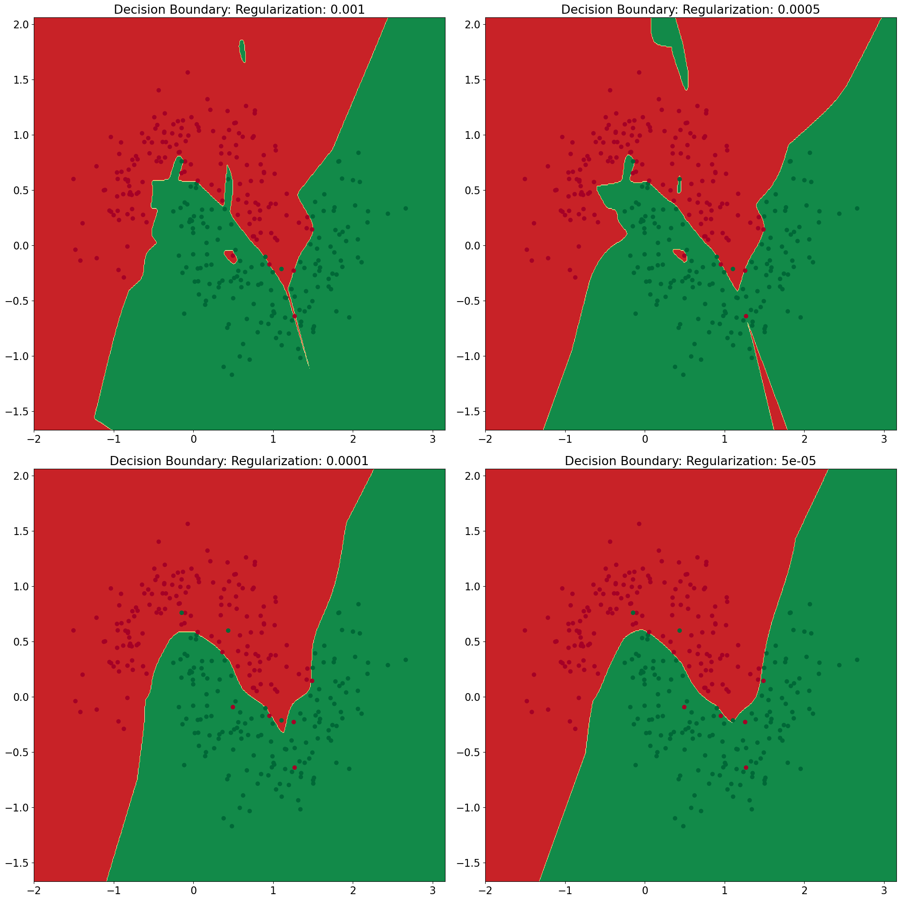
    


Learning rate에 따른 decision boundary를 나타낸 그래프이다. Learning rate는 모델이 가중치를 어마나 큰 폭으로 업데이트 할지를 결정하는 매개변수이다. 일반적으로 learning rate이 클수록 모델이 더 빠르게 학습하지만, 너무 높을 경우 optima를 넘어 불안정해질 수 있다. 반대로 learning rate이 낮을수록 모델이 더 천천히 학습하고, 최적화 과정에서 더 안정적이지만 너무 낮으면 충분한 학습이 이루어지지 않을 수 있다. 

- Learning rate = 0.001  
Decision boundary가 매우 non-linear하고 모델이 복잡한 데이터를 학습할 수 있다. 모델이 효과적으로 학습하는 것처럼 보일 수 있지만 overfitting이 발생한 것처럼 판단할 수도 있다. 


- Learning rate = 0.0005  
Decision boundary가 여전히 복잡하지만, learning rate가 0.001일 때보다 좀 더 단순한 형태를 띈다. 이는 learning rate이 작아질수록 모델이 덜 복잡한 패턴을 학습하고 있다는 것을 의미한다. 


- Learning rate = 0.0001  
Decision boundary가 더욱 단순해지고, 일부 영역에서는 linear에 가깝게 출력된다. 이는 learning rate이 낮아짐에 따라 underfitting이 일어나기 시작했다고 판단할 수 있다. 


- Learning rate = 0.00005  
하나의 영역에 존재하는 noise data를 모두 무시하는 경향이 보이고, 거의 linear한 경계를 형성하는 것을 확인할 수 있다. 이는 learning rate이 너무 낮아 모델이 데이터의 중요한 특징을 capture하지 못하고, 결과적으로 underfitting이 일어난 것으로 판단할 수 있다. 

### Analysis of the above results

#### Epoch에 따른 변화

Neural Network은 시간이 지남에 따라 손실이 감소하고 정확도가 증가한다. 하지만 Epoch의 수가 너무 커지게 되면 training data 너무 overfitting이 되어 새로운 데이터에 대해 제대로 작동하지 않을 수 있다. 따라서 무작정 epoch의 수를 늘린다 해서 generalization ability가 증가하는 것은 아니다라는 것을 유의해서 training 해야 한다.  
Flat code와 Modular code에 따라 약간의 다른 output을 만들어냈는데, Modular code를 사용했을 때 상대적으로 좀 더 안정적이고 loss 값이 좀 더 작았다.  

Flat code를 사용할 경우 하나의 클래스 내부에서 모든 계산을 진행하였기 때문에 코드를 추적하고 작성하기가 상대적으로 쉬웠다. 하지만 새로운 기능을 추가하거나 기존 기능을 수정할 때 전체 class를 수정해야 했기 때문에 유연성이 떨어지고, 특정 기능을 계속해서 반복적으로 작성해줘야 하기 때문에 반복되는 과정이 많았다.  

Modular code를 사용할 경우 각 기능을 모듈화하여 필요한 곳에서 쉽게 재사용이 가능했다. 또한 새로운 기능을 추가할 때, 기존 코드를 크게 변경하지 않고도 새로운 모듈을 추가할 수 있어 편리했다.


#### Random initialization vs Constant initialization

- Random initialization  
    - 대칭성을 파괴하여 뉴런이 서로 다른 패턴을 학습할 수 있다.
    - 초기 가중치를 random하게 설정할 경우 gradient descent으로 좀 더 다양한 영역의 loss function을 찾을 수 있어 global minimum을 찾는데 도움이 된다. 
    - 적절한 분산을 가진 randomized initialization은 모델이 빠르게 converge 되도록 해준다.
    - 초기 가중치가 너무 크거나 작으면 학습이 불안정해질 수 있고, random seed를 설정하지 않을 경우 동일한 코드를 실행할 때마다 다른 결과를 출력하게 된다.  

- Constant initialization
    - 상수로 initialize 할 경우 매 시행마다 같은 결과를 출력할 수 있다.
    - 모든 가중치가 같은 값으로 초기화 될 경우 모든 neuron이 동일한 출력을 생성하게 되며 이로 인해 training process에서 서로 다른 feature를 학습하지 못한다. 
    - Gradient descent 이후의 모델이 데이터의 복잡성을 학습하지 못할 수 있다. 
    - NN이 데이터의 복잡한 패턴을 충분히 학습하지 못해 단순화된 모델을 형성한다. 
    

#### Relationship between the number of hidden layers and decision boundary.

Hidden layer의 개수에 따라 decision boundary는 다르게 출력되기 때문에 overfitting이 발생하지 않는 선에서 데이터의 기본 패턴을 학습할 수 있는 capacity를 갖도록 적절한 수의 hidden layer를 설정해야 한다.  
Hidden layer의 개수가 증가할 수록 모델의 성능은 어느 정도까지 향상되지만, 그 이후에는 더 복잡해지더라고 decision boundary가 좋아지지 않고 오히려 noise까지 포착하게 되어 overfitting을 발생시킨다. 이는 bias-variance trade-off 현상이 발생하는 것이다.


#### The effect of regularization with respect to the performance.

Regularization 값에 따른 bias-variance trade-off 현상을 확인할 수 있는 과정이다. Regularization value가 0일 경우 모델이 휸련 데이터의 noise에 너무 잘 fitting 하여 variance가 커지게 된다(overfitting). Regularizaton value가 너무 클 경우 모델의 bias가 커져 데이터의 복잡성을 포착하지 못한다(underfitting). 적절한 갑의 regularization value를 선택하여 bias와 variance 사이의 balance를 유지해야 한다. 


#### The effect of learning rate with respect to the performance. 

위의 결과들을 보면 learning rate이 너무 낮을 경우 model이 training data의 중요한 feature를 충분히 학습하지 못하고 decision boundary가 지나치게 단순해져 underfitting 현상이 발생하게 된다.  
반면, 적절한 크기의 learning rate을 가진 model에 대해서는 데이터의 복잡성을 잘 포착하면서 generalize할 수 있는 decision boundary를 형성한다. 

